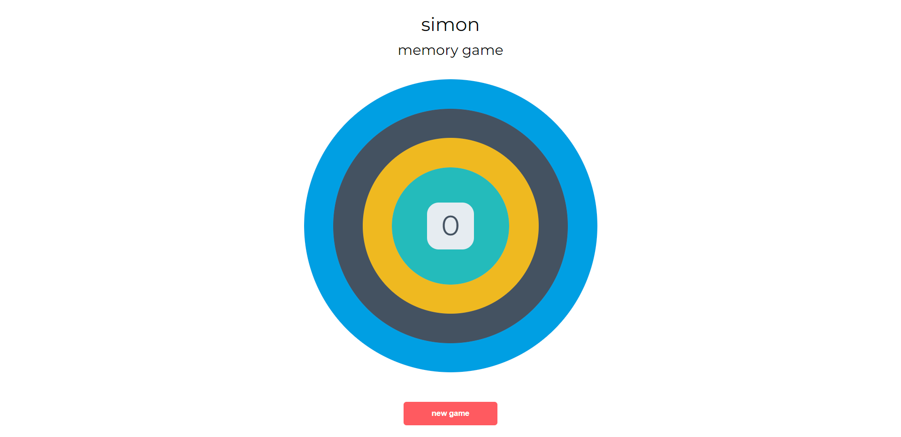

# Memory game
To play this memory game open a bash terminal and type:
python3 -m http.server

# About this application 
* This application is a game designed to test your memory, the main goal is to guess as many as you can correctly.
* This game was created with the help of Code Institute.
